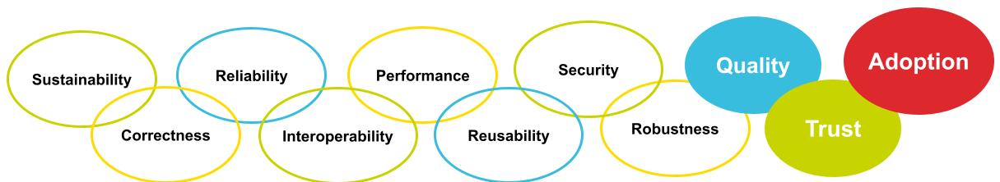
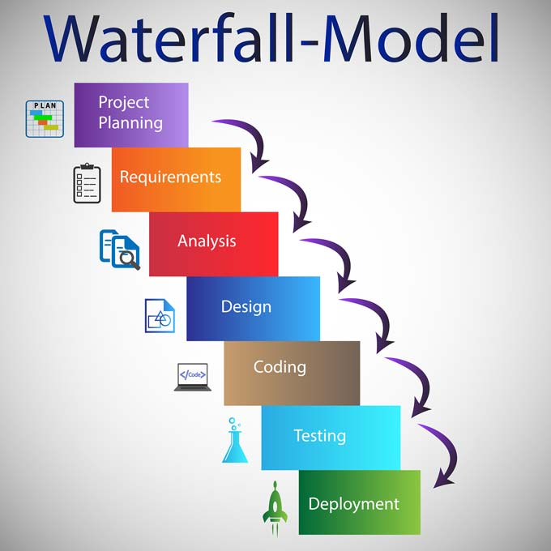
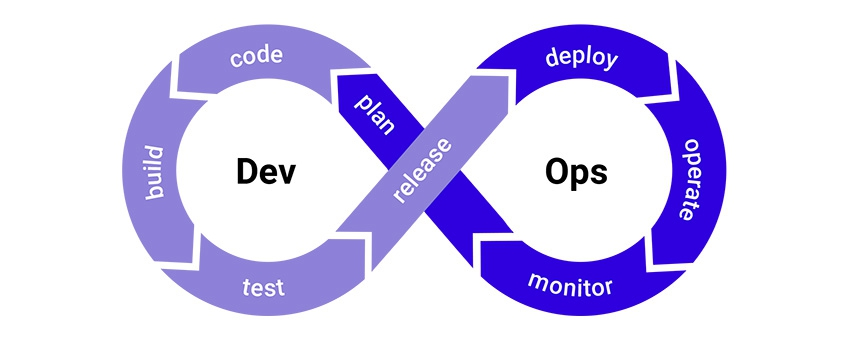
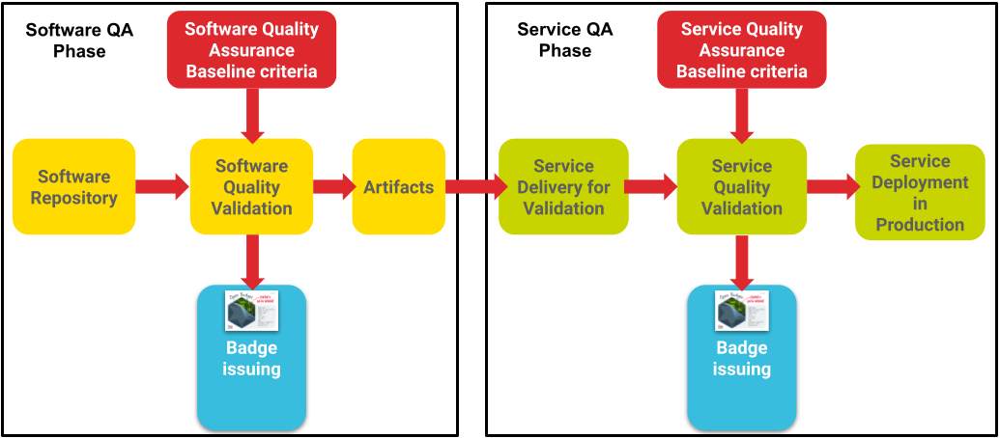
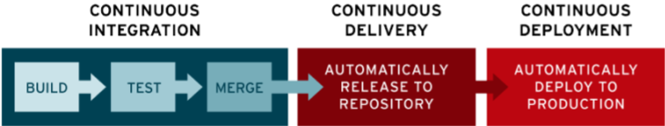
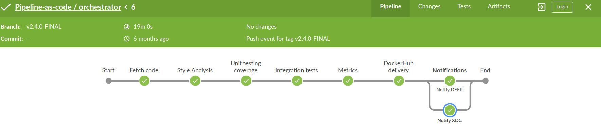
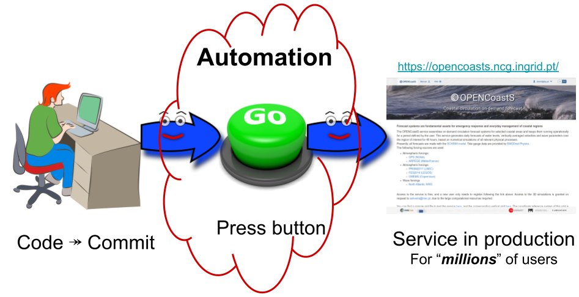

# Introduction

## Importance of Software and Service Quality assessment in Research

* Quality assessment is an important trait for software and for services.
* It allows users and managers to have higher trust on the Software and Services during their use and operation:
  * They expect that the software and related services will work as supposed.
  * Give the expected results and meet their requirements.
* It also contributes to the maintainability, stability and sustainability of the software and services.
* It contributes to facilitating the collaboration between software developers and promotes good practices for Software development.
* It promotes good practices for service development and operation.

## Software Development methodologies

### SW development: In the past

As an example, one wide used SW development methodologies was the **Waterfall** model. It was characterized an depicted in the following figure:

Source with other SW Dev. methodologies:
<https://www.outsource2india.com/software/mobile-applications/project-methodologies.asp>

The project phases were characterized by:

* Long periods, both between phases, as well as the overall process.
* Rigid and linear approach.
* Each phase has distinct goals.
* Once a phase is completed, there is no turning back.
* Does not allow room to accommodate inevitable changes.

### DevOps methodology

* Is a set of **good practices**.
* Supported by **Continuous Integration/Continuous Delivery/Continuous Deployment - CI/CD(D)**.
* Enhances collaboration between the departments or groups.

The SW development life cycle is depicted in the next figure.

Source: <https://www.synopsys.com/blogs/software-security/top-4-software-development-methodologies/>

It's characterized by the following high level phases:

* Development: *plan* &#10230; *design* and *code*.
* Quality assurance: *build*, *test*, *release* and *deployment* &#10230; CI/CD(D).
* Operations.

Short periods between phases &#10230; Fast + Automation.

## What are Quality Models

Software product quality models assess the quality properties of software products [Ref3](###ref3).
Thus, a quality model is a set of Quality properties, or Quality Criteria that can be assessed for a
given Software product.

The most relevant quality model [Ref3](###ref3), is the standard defined in the ISO/IEC
25010:2011(en) [Ref4](###ref4) Systems and software engineering, denoted: "Systems and software
Quality Requirements and Evaluation (SQuaRE) - System and software quality models". (It replaces the
ISO/IEC 9126-1:2001).

Regarding Quality models in the framework of European projects, these are based on Maturity Levels
of the Software or service. The EOSC-hub guide proposes characteristics to help assess the maturity
of a service via the operational definition of the Technology Readiness Level (TRL) indicators,
TRL, 7, 8 and 9 [Ref7](###ref7):

* TRL 7 - Beta: "System prototype demonstration in operational environment".
* TRL 8 - Production: "System complete and qualified"
* TRL 9 - Production: "Actual system proven in operational environment"

CESSDA's Software Maturity Model (SMM) [Ref8](###ref8), describes an approach for assessing the
maturity of the components of the technical Research Infrastructure (RI), to meet as a prerequisite
to supplying software artifacts for the RI. The Software Maturity grade is based on the Reuse
Readiness Levels (RRLs), as developed by NASA Earth Science Data Systems. Each criteria is graded
with 5 levels. The criteria are about: Documentation, Intellectual Property, Extensibility,
Modularity, Packaging, Portability, Standards Compliance, Support, Verification and Testing,
Security, Internationalization and Localization, Authentication and Authorization.

On the other hand, the DevOps approach links development and operations for software components,
through the use of a Continuous Integration and Continuous Delivery pipeline. The CAMS model stands
for Culture, Automation, Measurement and Sharing, which are named as the four-fundamental dimensions
to enable DevOps [Ref5](###ref5). It does not have a single standard, but takes the best practices
from several standards. The authors of [Ref6](###ref6), propose a Quality model based on DevOps,
while it reviews some of the other Quality models. The metrics are based on several sources and are
posed as questions. These questions/metrics focus on the number of features delivered, the time a
feature needs to be delivered or the number of releases to deliver these features. They also map
most of the metrics with the Product Quality model of the ISO/IEC 25010:2011.

For further details c.f. [Ref2](###ref2).

## Vision and high level architecture

The following figure can be interpreted in two axis. The vertical view represent the high level
architecture of the Quality Assurance developed in EOSC-Synergy.

1. **Top layer (red)**: Quality Assurance baseline documents: Detail a set abstract quality metrics.
2. **Middle layer (yellow/green)**: SQA as a Service (SQAaaS): Implement Quality assessment based on
   the baselines documents, (c.f. Course
   [*Software Quality Assurance as a Service*](https://moodle.learn.eosc-synergy.eu/course/view.php?id=139)).
3. **Bottom layer (blue)**: Issue badges: as a proof that a given Software or Service has passed the
   Quality Assurance criteria.

The horizontal view, represents the practical implementation, on the left hand side, the box
represent the Software QA phase which links to the right hand side box representing the Service QA
phase.

## Continuous Integration/Continuous Delivery/Continuous Deployment - CI/CD(D)

CI/CD - meaning and introduction.

* CI &#10230; Continuous Integration:
  * Coding.
  * Building: includes Automation &#10230; produces artifacts.
  * Testing: includes Automation and SW Quality Assurance (of produced artifacts).
* Code Review: manual step, comments/approval/voting by partners/colleagues/contributors.
* CD &#10230; Continuous Delivery &#10230; Deployment:
  * Delivery: Artifacts are released - ready for usage (by users or system administrators) in production.
  * Deployment: refers mainly to services &#10230; Installation, configuration, service (re)start.

A real example is show in the next figure depicting a Jenkins CI/CD pipeline (further details can
be found in follow up the Course
[*Software Quality Assurance as a Service*](https://moodle.learn.eosc-synergy.eu/course/view.php?id=139)).

## DevOps and automation

The following picture can be envisioned when considering DevOps and automation.

***Scary*** but in the real world/practice not *all* steps or phases are automatic or automated, for
example:

* "Code Review" is a manual step.
* In many cases - the process is stopped in the "Delivery" step.
* In many cases - the automated deployment is preformed in a "Staging" or "Pre-production" or 
  Preview" infrastructure, (not on the production service/infrastructure).

## References

### [Ref1]

Mario David presentation 2019 <https://docs.google.com/presentation/d/1SZbqpU3LLKY6ye-_zYNgxjLSNDX5CpIdxJ_Y0Io6vn0/edit#slide=id.g3d2cbff6ef_1_64>

### [Ref2]

EOSC-Synergy Deliverable D3.1 <https://digital.csic.es/handle/10261/219306>

### [Ref3]

Galli, Tamas, Francisco Chiclana, and Francois Siewe.
"Software Product Quality Models, Developments, Trends and Evaluation."
SN Computer Science, 1:154, (2020). <https://doi.org/10.1007/s42979-020-00140-z>

### [Ref4]

ISO/IEC 25010:2011 Systems and software engineering -
Systems and software Quality Requirements and Evaluation (SQuaRE) -
System and software quality models: <https://www.iso.org/standard/35733.html>

### [Ref5]

Humble, J. and Farley, D. (2011), Continuous delivery: Reliable software releases through build,
test, and deployment automation, A Martin Fowler signature book, Addison-Wesley, Upper Saddle River.

### [Ref6]

König, Leon, and Andreas Steffens. "Towards a quality model for devops." Continuous Software
Engineering & Full-scale Software Engineering (2018): 37.

### [Ref7]

EOSC-hub Service Maturity Classification: <https://eosc-portal.eu/providers-documentation/eosc-provider-portal-resource-maturity-classification>

### [Ref8]

John Shepherdson, CESSDA Software Maturity Levels (2019), DOI: 10.5281/zenodo.2591055
