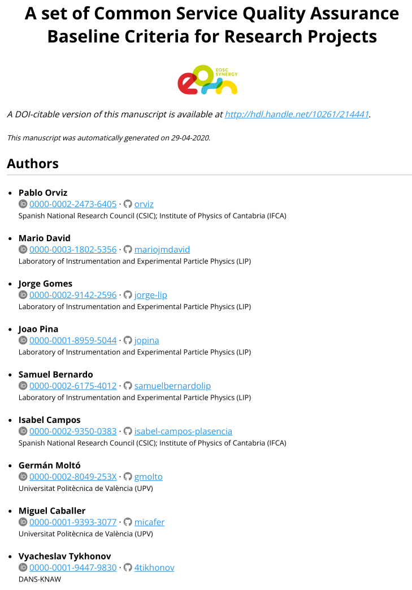
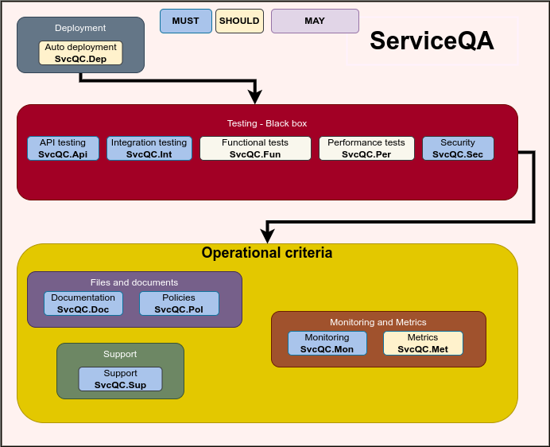
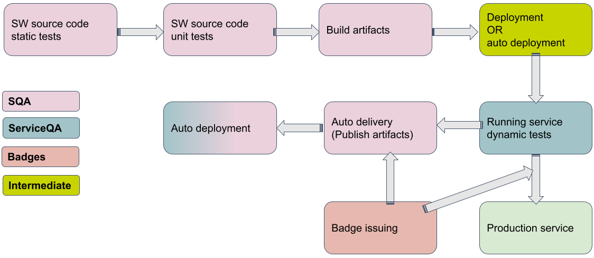
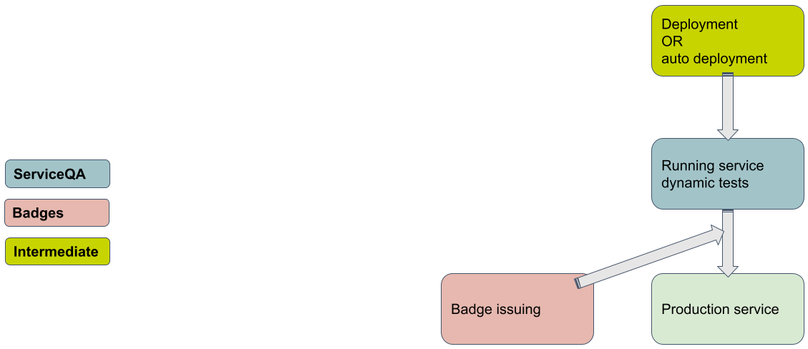
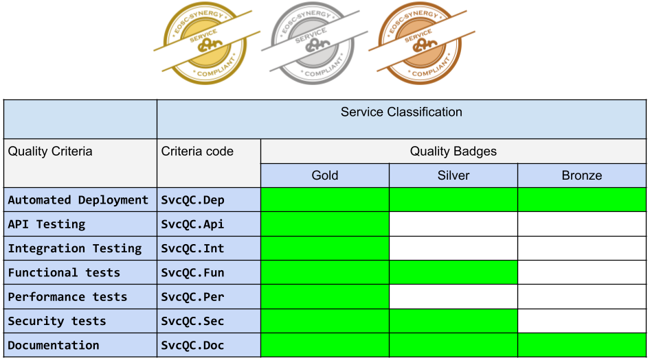

# Service Quality Assurance

## Contextualization of a Service

Service, represents the following:

* [Web Service](https://techterms.com/definition/web_service):
  * A Web Service is an application or data source that is accessible via a standard web protocol (HTTP or HTTPS).
  * Web Services are designed to communicate with other programs, rather than directly with users.
  * Most Web Services provide an API, or a set of functions and commands, that can be used to access the data.

* [Web Application](https://techterms.com/definition/web_application):
  * A Web Application or Web App is a software program that is delivered over the Internet and is accessed through a web browser.

* [Platform / Service Composition](https://csrc.nist.gov/glossary/term/Service_Composition):
  * Aggregation of multiple small services into larger services, according to a service-oriented (SOA) and/or microservices architecture.
  * An integrated set of Web Services, Web Applications and software components.

Examples are: Web portals, Scientific portals and gateways, data repositories.

## The Service Quality Assurance baseline

The Service Quality Assurance applies to Service development and operation best practices and procedures.

* The ServiceQA baseline is a set of abstract criteria that should be applied to the process of Service development deployment and operation.

* Criteria properties are the same as for the SQA baseline.

* Criteria can be assessed/verified by the SQAaaS.

* These criteria complements the criteria described in the "Software Quality Assurance baseline"

## Goals

The baseline, harnesses the capabilities of the quality factors in the underlying software to lay out the principles for attaining quality in the enabled services. The Service Quality baseline aims at fulfilling the following goals:

1. Complement with a DevOps approach the existing approaches to assess and assure the quality and maturity of services.

2. Build trust on the users by strengthening the reliability and stability of the services, with a focus on the underlying software, thus ensuring a proper realization of the verification and validation processes.

3. Ensure the functional suitability of the service by promoting testing techniques that check the compliance with the user requirements.

4. Improve the usability by identifying the set of criteria that fosters the service adoption.

5. Promote the automated validation of the service quality criteria.

## Quality model

The diagram show the Service QA model:

The criteria are organized in major categories as follows:

Automated:

1. Deployment:
    1. Infrastructure as Code (IaC) for deployment and configuration: Criteria for Automated Deployment.

2. Dynamic testing - Black box testing
    1. Criteria regarding code style and "Black box" testing such as; API Testing, Integration Testing, Functional tests, Performance tests, Security.

Operational:

1. Files and documents:
    1. Criteria regarding documentation of the Service and Policies.

2. Support:
    1. Criteria about the existence of support service for issue tracking, communication with users, reporting of problems.

3. Monitoring and Metrics:
    1. Criteria regarding monitoring is particularly important for a service in production, it can include the execution of some or all tests from Black-box testing. While metric collection is important for reporting the usage of the service including accounting of resources.

## Automated tests

### 1. Deployment

Automated Deployment:

* Implies the use of code to install and configure the service in the target infrastructures.

* Infrastructure as Code (IaC) templates allow operations teams to treat service provisioning and deployment.

* IaC enables the paradigm of immutable infrastructure deployment and maintenance, where Services are never updated, but deprovisioned and redeployed.

* An immutable infrastructure simplifies maintenance and enhances repeatability and reliability.

* Production-ready Service can be deployed as a workable system. 

### 2. Dynamic testing - Black box testing

Set of tests that are performed in a running service, with no knowledge of its inner working. Comprises:

1. API Testing:
    * Web services commonly use application programming interfaces (APIs) to expose the available features to external consumers.
    * Covers the validation of the features outlined in the specification.
    * Cover security related criteria.

2. Integration Testing:
    * Integration testing refers to the evaluation of the interactions among coupled Services or parts of a system that cooperate to achieve a given functionality.

3. Functional tests:
    * Involves the verification of the Service identified functionality, based on requested requirements and agreed design specifications.
    * This type of testing focuses on the evaluation of the functionality that the Service exposes, leaving apart any internal design analysis or side-effects to external systems.
    * Includes Web/Graphical User Interface

4. Performance tests:
    * Performance testing verifies that the software meets the specified performance requirements and assesses performance characteristics - for instance, capacity and response time.
    * Includes:
        1. Stress or Load testing, exercises software at the maximum design load, as well as beyond it, with the goal of determining the behavioral limits, and to test defense mechanisms in critical systems.
        2. Scalability testing is a test methodology in which an application’s or Service performance is measured in terms of its ability to scale up and/or scale out the number of user requests or other such performance measure attributes, through an increase in the amount of available resources.
        3. Elasticity is based on how quickly Services in an infrastructure are able to adapt in response to variable demand or workload for those service(s).

5. Security tests:
    * Security assessment is essential for any production Service
    * The security testing of a Service is also a black-box type of testing.
    * Focuses on the runtime analysis of security-related requirements, as part of the Dynamic Application Security Testing (DAST) as well as the Interactive Application Security Testing (IAST).
    * Compliance with security policies and regulations complements the analysis, which can be implemented, continuously validated and monitored through the Security as Code (SaC) capabilities.
        * SaC is a particularly suitable tool for endorsing security of Service Composition deployments.

## Operational criteria: Service in production

### 1. Files and documents

1. Documentation:
    * Is an integral part of any Software or Service. For example, it describes how and what users can use and interact with it, or how operators can deploy, configure and manage a given Software or Service.
    * Adopt FAIR principles.
    * List of documents that should exist such as: User manual, deployment/administrator manual, API manual (when applicable), etc.

2. Policy documents such as:
    * Acceptable Usage Policy (AUP)
    * Access Policy or Terms of Use
    * Privacy Policy.

### 2. Support

1. Support:
    * Is the formal way by which users and operators of the Service communicate with other operators and/or developers of the Service in case of problems.
    * Operational problems or bugs in the Service or underlying Software.
    * Reporting of enhancements, improvements and documentation issues.
    * Existence of a tracker or helpdesk for operational and users issues.

### 3. Monitoring and Metrics

1. Monitoring:
    * Is a periodic testing of the Service.
    * It requires a monitoring service from where tests are executed or sent and results of those tests are shown.
    * The tests can be the same, in part or in total of the Functional, Security and Infrastructure tests.
    * The technology used for the monitoring is left to the developers of the underlying software to decide eventually with input from the infrastructure(s), where the Service is foreseen to be integrated.

2. Metrics:
    * Quantifiable measure used to track and assess the status of a specific process.
    * In the case of Services, some relevant metrics are the number of users registered in the Service, or of active users.
    * Also accounting is important to track resource usage per user or group of users, either or both computing and storage resources.

## Integrating SQA and Service QA: With open-source code

## Integrating SQA and Service QA: With Commercial/Closed source SW

## Awarding badges according to criteria passed

EOSC-Synergy approach defines three different badge classes for services: bronze, silver and gold.

Mapping between quality criteria and EOSC-Synergy digital badges is shown in the following table.

