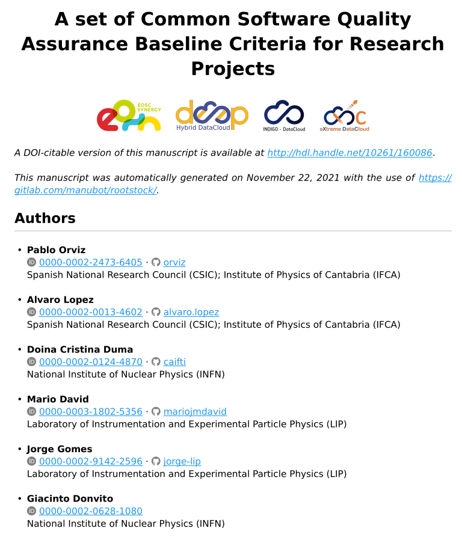
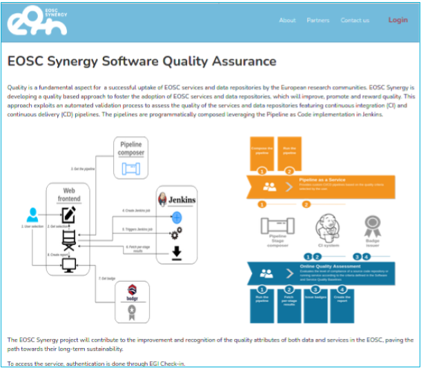
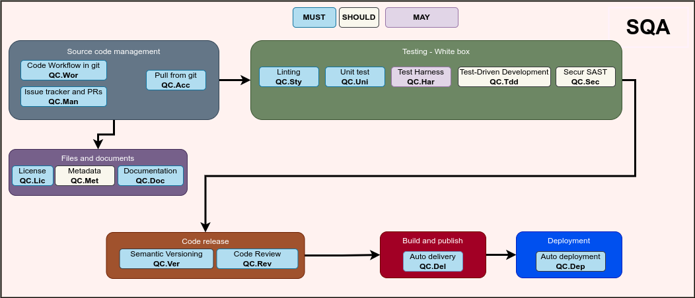
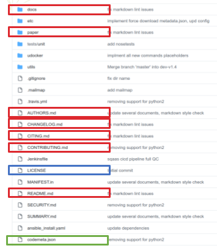
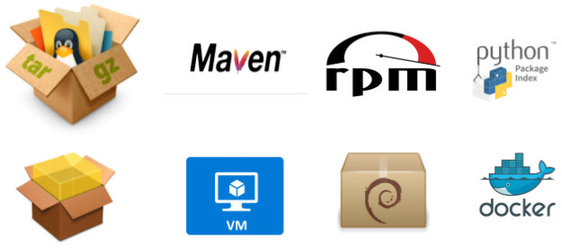
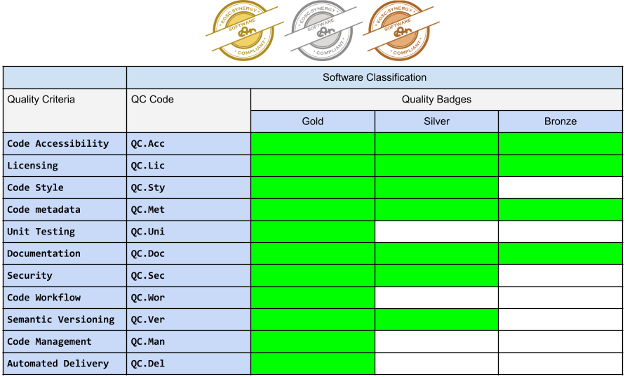

# Software Quality Assurance

The SW Quality Assurance applies to Software source code best practices and procedures.

## The SW Quality Assurance baseline

The SQA baseline (figure below) is a set of abstract criteria that should be applied to the process of SW
development. Each criterion has a severity according to the keywords defined in
[RFC2119](https://www.rfc-editor.org/info/rfc2119): "MUST", "MUST NOT", "REQUIRED", "SHALL",
"SHALL NOT", "SHOULD", "SHOULD NOT", "RECOMMENDED", "MAY", and "OPTIONAL".

Furthermore, each criterion is binary, with a value of "0" or "1" such that when implemented in practice (c.f. Course
[*Software Quality Assurance as a Service*](https://moodle.learn.eosc-synergy.eu/course/view.php?id=139)),
it "*passes*" or it "*does not pass*" that criterion.

## Quality model

The figure below depicts the Software Quality baseline criteria.

The criteria are divided into six major categories:

1. Source Code management:
    * Criteria describing where source code should reside, and how it should be managed when there are changes.

2. Files and documents:
    * Criteria describing what files should exist such as licensing and code metadata, and documentation.

3. Static testing &#10230; White box testing:
    * Criteria regarding code style and "White box" testing such as unit tests and static security tests.

4. Code release:
    * Criteria regarding the release of SW such as versioning and code review/approval before the release.

5. Build and publish &#10230; Delivery:
    * Criteria for automated build of SW artifacts, notification and publishing in SW public repositories.

6. Deployment:
    * Criteria for automated deployment of SW into a working/production ready state, with configuration management tools.

## Quality attributes explained

### Source Code management

Following the open-source model:

* The source code being produced must be open and publicly available.
  * This is a way to promote the adoption and augment the visibility of the  software developments, as well as promoting external contributions.

* The management must be done in a version control system:
  * as the way the support contributions from multiple developers through the branching model.
  * Each developer can work on his branch independent from the others.
  * The changes can be pulled or merged to a *next release* branch when a given fix or feature is complete.

* A given master or main branch can be kept in a working state (latest release):
  * Pulled/merged changes are only accepted if they have passed/gone through a full set of automatic tests
  * As well as peer review.

* The management of source code must have:
  * An issue tracker where bugs, corrections and features are reported and followed.
  * When the developer works and completes a given bug fix, correction or new feature, he can refer to the corresponding issue.

### Files and documents

* Existence of an open source **License**.

* Existence of **metadata** describing the SW:
  * Towards FAIR for SW.

* **Documentation**:
  * Exists alongside the source code.
  * Details all documents that should be present.
  * Is treated as code - Version Controlled
  * Written in plain text format using some markup language.

### Static testing / “White box” testing

The general definition is:

* White box testing techniques analyze the internal structures the used data structures, internal design, code structure and the working of the software (<https://www.geeksforgeeks.org/software-engineering-white-box-testing/>).
  * It pertains in general to "Unit Tests".

* The quality model presented here, relies on a broader category called "Static testing" that includes all types of tests that
can be performed on the "source code":
  * "Code style".
  * "Unit tests".
  * "Test Harness".
  * "Test-Driven Development".
  * "Static Security testing".

### Code release

* Version format Semantic Versioning.
  * Set the version to be released.

* Code review:
  * Implies the informal, non-automated, peer review of any change in the source code.
  * It appears as the last step in the change management pipeline, once the candidate change has successfully passed over the required set of change-based tests.
  * Open and collaborative, allowing external experts revisions.
  * Review of documentation.
  * Assess the inherent security risk of the changes, ensuring that the security model has not been downgraded or compromised by the changes.

### Build and publish; Delivery

* Automated delivery comprises:
  * The build of Software into an artifact.
  * Its upload/registration into a public repository of such artifacts.
  * Notification of the success of the process.

### Deployment

* Automated Deployment:
  * Production-ready code can be deployed as a workable system. 
  * Minimal user or system administrator interaction.
  * Leveraging software configuration management (SCM) tools.

## Awarding badges according to criteria passed

EOSC-Synergy approach defines three different badge classes: bronze, silver and gold.
Mapping between quality criteria and EOSC-Synergy digital badges is shown in the following table.

